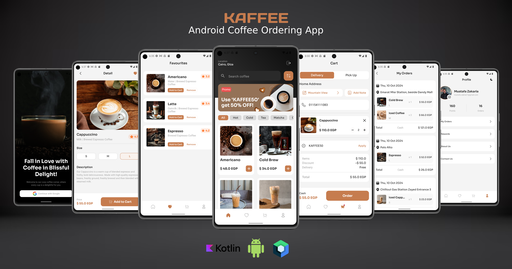

# KAFFEE
A coffee ordering app which user can make an order and add his address or pickup the order at specific branch.

# Project Title

Kaffee App

## Description

### Features:
🔻 Easily logging in using google account.
🔻 Redirect to sign in to google if there are not signed in google accounts.
🔻 Browse through a wide range of products to meet your shopping needs.
🔻 Cashed products for offline shopping.
🔻 Favorites: Easily mark products as favorites for quick access and future reference.
🔻 Product Details: View detailed product descriptions, specifications and make an order.
🔻 Shopping Cart: Add, remove, and manage items in your shopping cart for convenient shopping.
🔻 Order through home delivery or pickup at branch.
🔻 Profile: Ability to view, and update personal information.
🔻 Dark theme. 

## Implemented using

🔻 Jetpack compose
🔻 Firebase: Firestore, Authentication, Storage
🔻 Kotlin flows
🔻 Room database
🔻 Shared Preferences
🔻 Coroutines
🔻 Dagger-hilt
🔻 MVVM

## Screens

  

 
